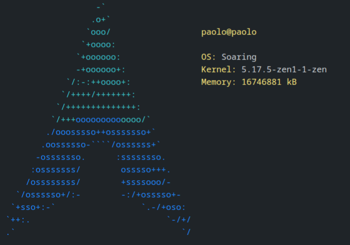

## rtfetch



## Configuration

Recompile each time you change the
[config file](./Fetch.toml)

You can write rust code in the `setup` section
and then use the variables with the `{}` blocks
in the info section.
You can write arbitrary code in any `{}` block.

A function `bash(cmd)` is also available to quickly execute a `bash`
command and get the stdout.

Example in the screenshot:

```toml
logo = "arch_thick.logo" # in src/assets.
setup = [
    "let sys = System::new_all();",
    "",
    "let host_name = sys.host_name().unwrap();",
    "let total_memory = sys.total_memory();",
    "let used_memory = sys.used_memory();",
    "let kernel_version = sys.kernel_version().unwrap();",
    "let uptime = sys.uptime();",
    "let cores = sys.physical_core_count().unwrap();",
    "let system_name = sys.name().unwrap();",
]
info = [
    "",
    "",
    "",
    "<yellow>{bash(\"whoami\")}@{host_name}",
    "",
    "<yellow><bold>System</bold>: <white>{system_name}",
    "<yellow><bold>Uptime</bold>: <white>{uptime / 3600} hours, {(60.0 * (uptime as f32 / 3600.0).fract()) as u8} minutes",
    "<yellow><bold>Kernel</bold>: <white>{kernel_version}",
    "<yellow><bold>Cores</bold> : <white>{cores}",
    "<yellow><bold>Memory</bold>: <white>{used_memory / 1000} MB / {total_memory / 1000} MB ({(100.0 * used_memory as f32 / total_memory as f32 + 0.5) as u8} %)",
    "<yellow><bold>Pacman</bold>: <white>{bash(\"pacman -Qq | wc -l\")} packages",
    "",
    "<red>███<yellow>███<green>███<cyan>███<blue>███<magenta>███<black>███<white>███",
    "<red!>███<yellow!>███<green!>███<cyan!>███<blue!>███<magenta!>███<black!>███<white!>███"
]
```